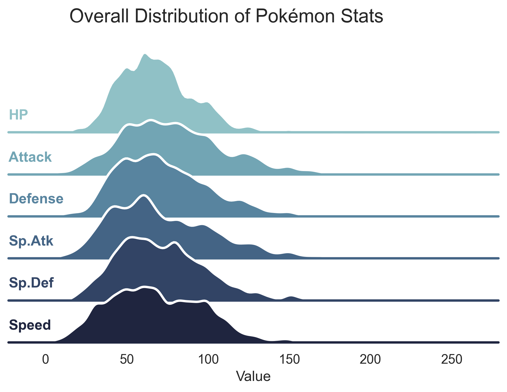
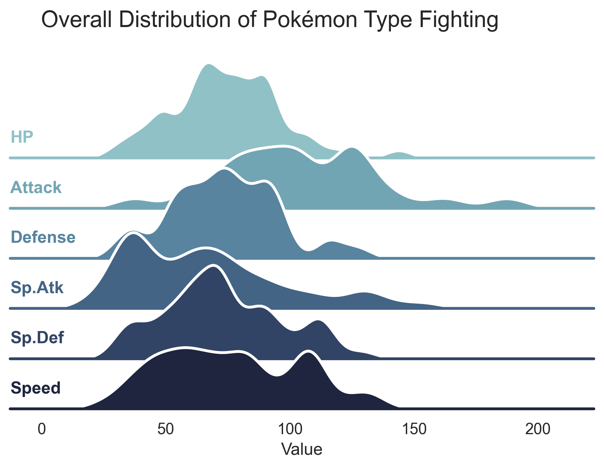
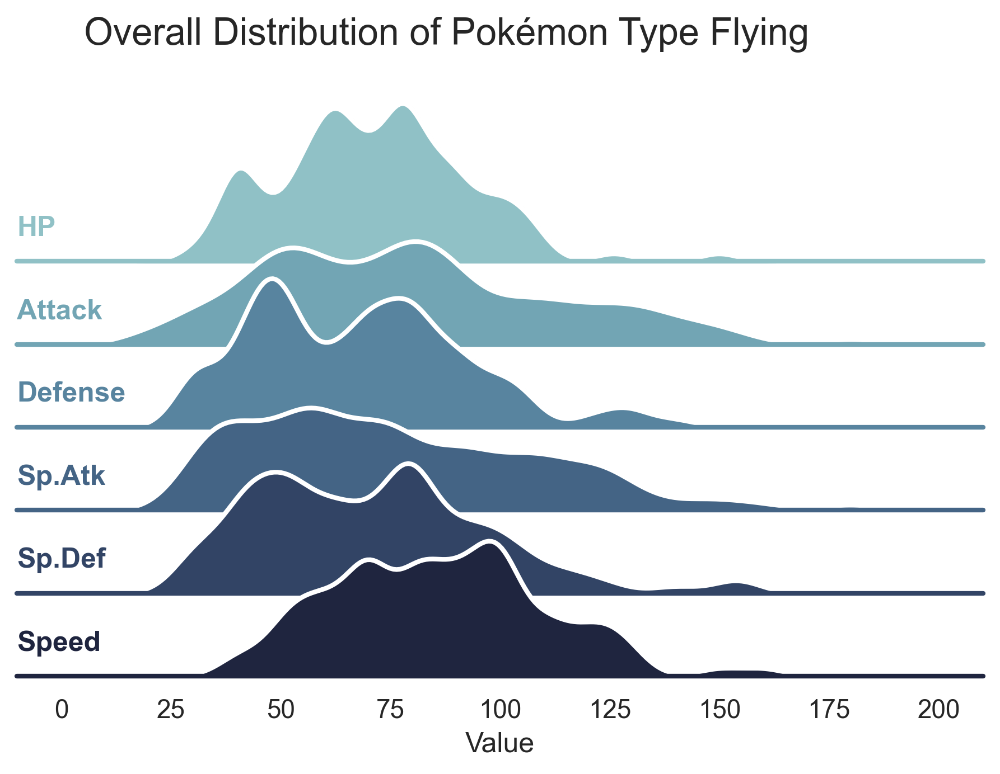
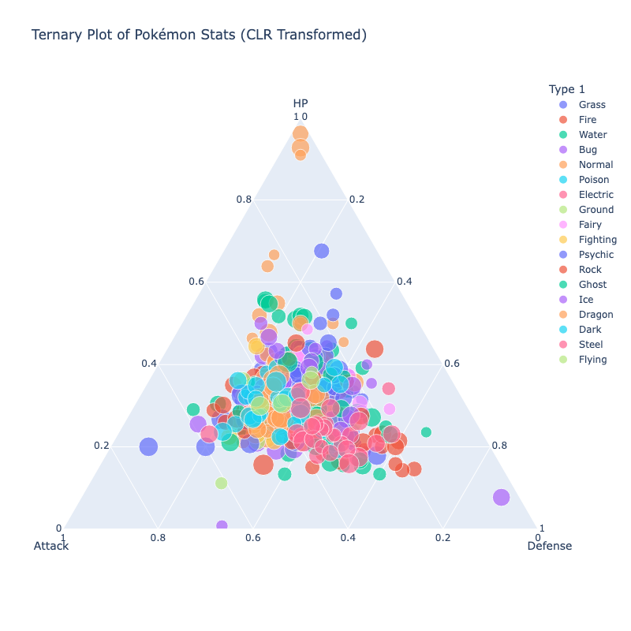
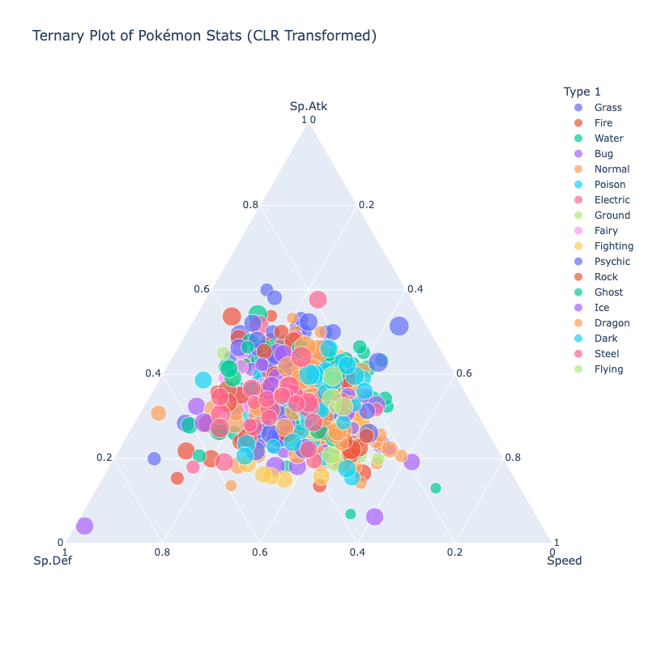
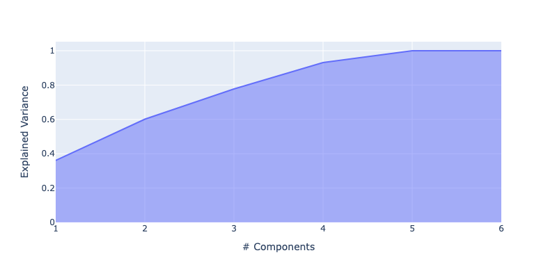
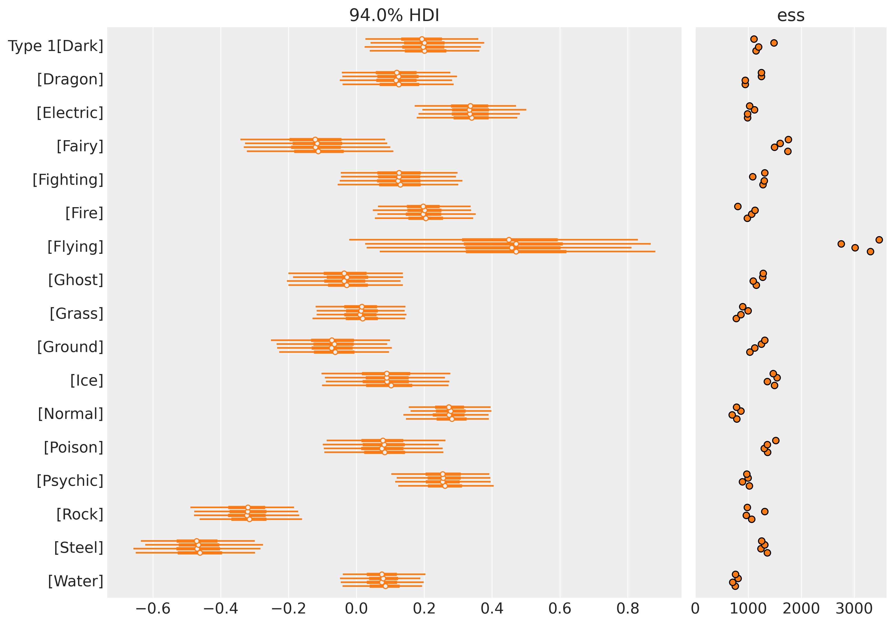
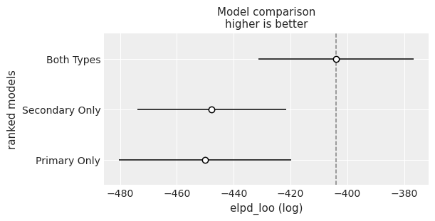
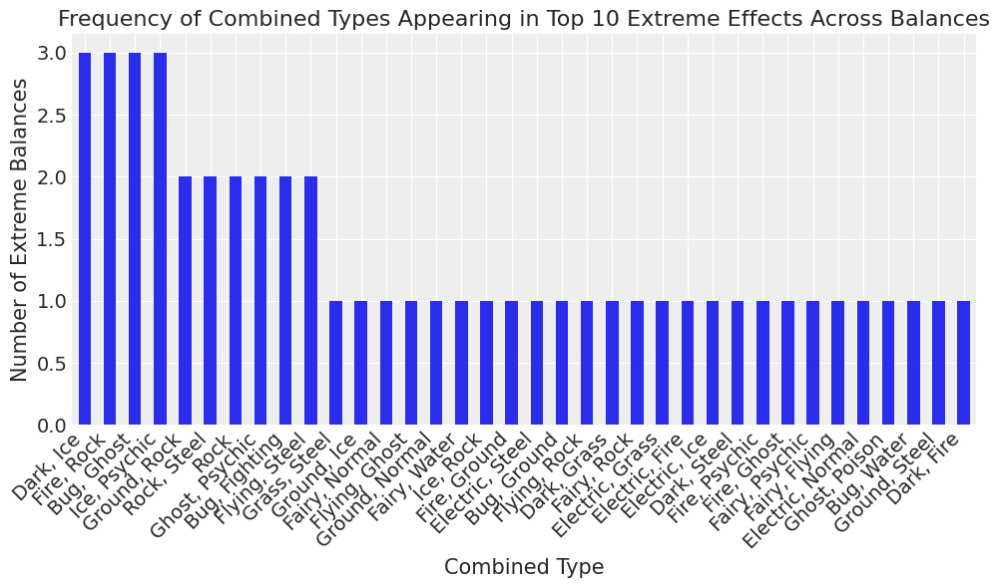

# Compositional Analysis of Pokemon stats and Typings Using Bayesian Statistics

## Goal
The goal of this analysis is to utilize the compositional data technique and bayestian statistics to uncover the game design patterns of Pokemons. 

## Tasks
1. Create a proper compositional transformation of pokemons and create simple statistics.
2. Build a bayesian statistical model to uncover the relationships between the pokemon typing and 6 stats.
3. Analyze the MCMC sampling result using bambi and arviz.

## Pokemon Dataset
The Pokemon dataset comes from a Kaggle Compepition at this [link](https://www.kaggle.com/datasets/abcsds/pokemon). The dataset consists of 800 Pokemons from generation 1 to generation 6. Each Pokemon is characterized by the typing (Primary and Secondary) and 6 stats (HP, Attack, Defense, Special Attack, Special Defence, Speed), along with the generation and if it's lengendary or not. 

## Basic Statistics
The distribution of the 6 stats of all pokemon is shown in Figure 1. 

Each of the stats are ranged from 1-255, and the average of each stats is around 70 and median is also at around 70 for all stats, as shown in Table 1. This shows that the pokemon design follows a general distribution. 

| statistic | HP | Attack | Defense | Sp.Atk | Sp.Def | Speed |
| :--- | :--- | :--- | :--- | :--- | :--- | :--- |
| count | 800.0 | 800.0 | 800.0 | 800.0 | 800.0 | 800.0 |
| null_count| 0.0 | 0.0 | 0.0 | 0.0 | 0.0 | 0.0 |
| mean | 69.25875 | 79.00125 | 73.8425 | 72.82 | 71.9025 | 68.2775 |
| std | 25.534669 | 32.457366 | 31.183501 | 32.722294 | 27.828916 | 29.060474 |
| min | 1.0 | 5.0 | 5.0 | 10.0 | 20.0 | 5.0 |
| 25% | 50.0 | 55.0 | 50.0 | 50.0 | 50.0 | 45.0 |
| 50% | 65.0 | 75.0 | 70.0 | 65.0 | 70.0 | 65.0 |
| 75% | 80.0 | 100.0 | 90.0 | 95.0 | 90.0 | 90.0 |
| max | 255.0 | 190.0 | 230.0 | 194.0 | 230.0 | 180.0 |

What makes the pokemon more interesting is the typings. As you can see in the example show in Figure 2 and Figure 3, Fighting Type has a higher value in Attak while Flying Type has a high value in Speed. The Type difference gives all pokemon unique profiles, which worth investigate further.

## Compositional Data Analysis
Consider each pokemon is defined by its 2 types and 6 stats, it is important to uncover the underlying relationship between the two. First, it is worthwhile to consider the composition of the stats for each pokemon, since the total of 6 stats are quite different for each pokemon and the total is irrelevant in our analysis for the relationship. Therefore, we apply CLR (Centered Logratio Transformation) and ILR (Isometric Logratio Transformation) to our dataset to observe the relative contributions of stats.

After the CLR transform, we can observe the relationship between stats in a ternary plot shown in Figure 4 and 5. The color of the dot represent their primary type and the size of the circle represents the total stats. Most of the pokemons are centered at around the average percentage with a few outliers. The only general trend we can see is the lower contributions of HP and Speed, which is also shown in the general statistics in Table 1.

To construct a basis for ILR transformation, we conducted a PCA analysis on CLR transformed data. The first 5 principle components explained more than 90% of the variance. From the loadings for each component, we can use the positive and negative loadings for each component as the constrast matrix for ILR transformation. 

| Principal Component | HP | Attack | Defense | Special Attack | Special Defense | Speed |
| :--- | :--- | :--- | :--- | :--- | :--- | :--- |
| **PC1** | -0.127522 | -0.166892 | -0.569489 | 0.2411 | -0.1242 | 0.747003 |
| **PC2** | -0.161497 | 0.682888 | 0.123036 | -0.411351 | -0.501294 | 0.268216 |
| **PC3** | 0.707017 | 0.233216 | -0.482436 | 0.15613 | -0.316002 | -0.297924 |
| **PC4** | -0.490685 | 0.289262 | -0.014382 | 0.733243 | -0.214939 | -0.302499 |
| **PC5** | -0.224378 | 0.448422 | -0.51081 | -0.209698 | 0.648503 | -0.152038 |

The following contrast matrix describes balances between each of the 6 stats. Notice that B1 is the most important one, which describes the tradeoff between speed and defense, intuitively pokemons are either slow but more resilient or the other way around. Subsquently, B2 describes the attack with special stats, which can be explained by the tradeoff normal stats or the special ones. B3 focuses on HP and defense stats. 

| | HP | Attack | Defense | Sp. Atk | Sp. Def | Speed |
| :--- | :-: | :----: | :-----: | :-----: | :-----: | :---: |
| **Balance 1** | 0 | 0 | -1 | 0 | 0 | 1 |
| **Balance 2** | 0 | 1 | 0 | -1 | -1 | 0 |
| **Balance 3** | 1 | 0 | -1 | 0 | -1 | 0 |
| **Balance 4** | -1 | 0 | 0 | 1 | 0 | -1 |
| **Balance 5** | 0 | 1 | -1 | 0 | 1 | 0 |

## Bayesian Statistical Model
Based on the ILR transformation, we built regression models that infer pokemon types based on each of the transformed vectors. 

### Model 1: Balance 1 ~ Primary Type
The first balance in ILR transform explains the Speed vs Defense, and we use linear regression model to see its relationship with primary type. We drew 2000 samples with 4 chains. The diagnostics showed 0 divergent transitions and all of the R hat is 1. Effective sample size is much higher for flying type due to limited data points. 

The model captures the relationship between Speed vs Defense quite well, as it shows Flying and Eletric have higher speed and lower defense, while Steel and Rock have lower speed but higher defense.

### Model 2: Balance 1 ~ Primary Type vs Secondary Type
With the success of first model, we want to test if primary type is more important than secondary or both information is needed to have a good descriptive model. Therefore, we constructed 3 models:
-  Balance 1 ~ Primary Type
-  Balance 1 ~ Secondary Type
-  Balance 1 ~ Primary Type + Secondary Type
  
We drew 2000 samples with 4 chains for each model, and we compared the models based on their expected log pointwise predictive density (ELPD). The result suggests that both types are needed to have an accurate prediction, while secondary type is more useful than primary type in prediction of balance 1.

### Model 3: Balance 1~5 ~ Combined Type
We built 5 regression models where each corresponding to a balance and the combined type. Each model is constructed the same way and 2000 samples with 4 chains were drew from each model.

Using these models, we can find out which combined types has the most different measure compare to other combined types. We sorted the results with 10 extreme balances from each model, and we counted the frequency of the extreme types. As shown in Figure 9, Dark & Ice, Fire & Rock, Bug & Ghost, and Ice & Psychic are the most extreme types, which can be used for game strategy.  

## Conclusion
In this project, we explored the game design of pokemon using compositional data analysis and bayesian statistics based on pokemon type and stats. We built a compositional dataset using CLR transformation on stats, and used PCA to find out the most important components that influence the pokemon stats. Using the components, we built three models that further discover the reasoning behind pokemon game design. We discovered that in general the pokemon stats are quite balanced, but type do influence the stats. Using bayesian modelling, we found out that the combination of primary and secondary typing influence the pokemon stats strongly. Lastly, we found out 4 combined types have more special stats than others. Overall, the balance of the overall pokemon stats, and the special types contributed to the success of the gameplay. 